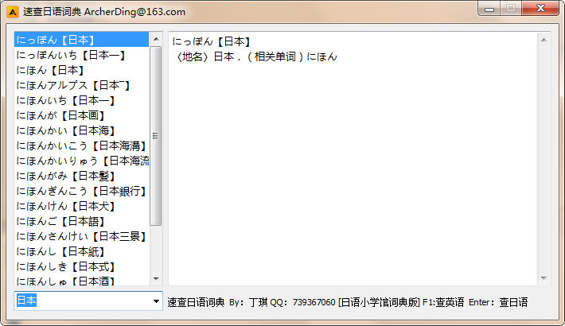

# EasyDict

速查词典可以在仅安装了中文输入法的环境下,输入日语并迅速词



Todo
======
- [x] 支持中文汉字自动转换日文汉字,如天气  --> 天気
- [x] 支持小写字母自动转换平假名,如konnnitiha --> こんにちは
- [x] 支持大写字母自动转换片假名,如KU-RU --> クール
- [x] 使用F1可查找英文对应的外来语,如message --> メッセージ
- [x] 部分支持字母自动转换为外来语,如update --> アップデート
- [x] 支持网络查找,更新词库,代理设置

安装方法:

> 为依赖库追加函数github.com/lxn/walk/blob/master/icon.go

```
func NewIconFromResourceId(resId uintptr) (ic *Icon, err error) {
	hInst := win.GetModuleHandle(nil)
	if hInst == 0 {
		err = lastError("GetModuleHandle")
		return
	}
	if hIcon := win.LoadIcon(hInst, win.MAKEINTRESOURCE(resId)); hIcon == 0 {
		err = lastError("LoadIcon")
	} else {
		ic = &Icon{hIcon: hIcon}
	}
	return
}
```
1. 到SQLite3 的下载页面(http://www.sqlite.org/download.html),下载 Windows 下的预编译包 DLL 的压缩包（sqlite-dll-win32-x86-XXX.zip），然后将里面的 DLL 文件拷贝到 system32 目录.

2. 安装 TMD 版的 GCC 编译器（http://tdm-gcc.tdragon.net/）

3. 执行`go get github.com/mattn/go-sqlite3`安装数据库驱动

4. 执行`go get github.com/akavel/rsrc`,安装资源打包工具

5. 执行`go get github.com/ArcherDing/EasyDict`,下载源码

6. `cd %GOPATH%/src/github.com/ArcherDing/EasyDict`

7. `./make.bat`
